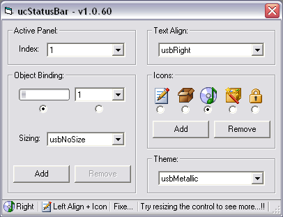



## ucStatusBar \- Theme\-Aware Owner Drawn StatusBar Control

### Description

ucStatusBar is a single file, self-subclassed StatusBar replacement control which supports complete customization per individual panel. Each panel supports the following independent properties: Text, Text Alignment (Left, Center, and Right), Auto/Manual Sizing, Editable (Dynamic Text Editing), Icons, Icon States (Enabled, Disabled), UseMaskColor, MaskColor, ForeColor, Font, ToolTipText, and Width. In addition the ucStatusBar as a whole supports BackColor, GripShapes (None, Classic Bars, XP Squares), Sizeable, and Theme Detection (Auto, Classic, Blue, HomeStead, and Metallic). ucStatusBar also provides dynamic runtime Control Binding to allow external controls (Progressbar, Droplist, etc) to be bound to individual panels. As a bonus, this submission also includes ucProgressbar, which is a self-subclassed Theme-Aware progress bar (modified from Mario Flores - Cool XP ProgressBar). So, If your project needs a modern lightweight StatusBar with dynamic runtime functionality without the overhead of dependencies, then this control might be just what the doctor ordered.

Enjoy!! TerriTop&#8230;
 
### More Info
 

             |
---                |---
**Submitted On**   |2007-08-10 13:19:32
**By**             |[TerriTop](https://github.com/Planet-Source-Code/PSCIndex/blob/master/ByAuthor/territop.md)
**Level**          |Advanced
**User Rating**    |4.8 (67 globes from 14 users)
**Compatibility**  |VB 6\.0
**Category**       |[Custom Controls/ Forms/  Menus](https://github.com/Planet-Source-Code/PSCIndex/blob/master/ByCategory/custom-controls-forms-menus__1-4.md)
**World**          |[Visual Basic](https://github.com/Planet-Source-Code/PSCIndex/blob/master/ByWorld/visual-basic.md)
**Archive File**   |[ucStatusBa2079018102007\.zip](https://github.com/Planet-Source-Code/territop-ucstatusbar-theme-aware-owner-drawn-statusbar-control__1-69132/archive/master.zip)

### API Declarations

See ucStatusBar.ctl Header

